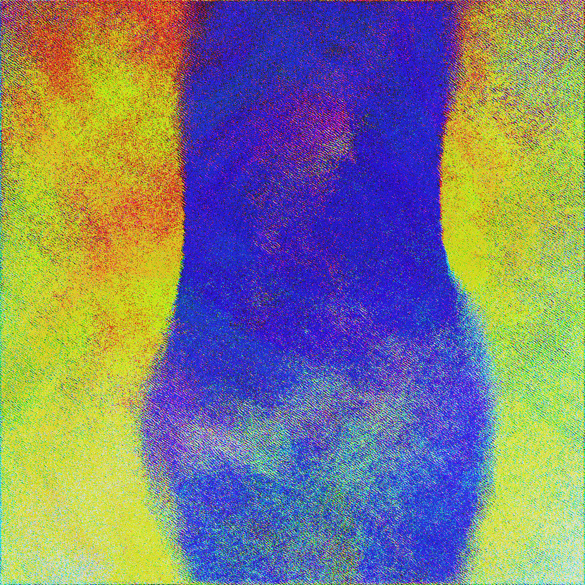

# Convolution Art Toy

An interactive real-time visualization tool that uses convolution layers and ECG-driven kernel drift to create dynamic, organic patterns. Explore different "souls" - each with unique convolution architectures that generate mesmerizing visual dynamics.



## Features

- **15 unique "souls"** - Different convolution architectures with distinct visual personalities
- **ECG-driven kernel drift** - Convolution kernels evolve organically based on a simulated heartbeat
- **Heart rate variability (HRV)** - Natural beat-to-beat variation synchronized with breathing
- **Interactive perturbations** - Click and hold to locally warp and perturb the image
- **Real-time parameter control** - Dynamic sliders for each soul's unique parameters
- **Pause/play functionality** - Freeze and capture moments with spacebar
- **Screenshot system** - Save timestamped PNGs of your favorite moments
- **Performance monitoring** - Toggle detailed timing breakdowns
- **Fullscreen mode** - Immersive visualization experience
- **GPU acceleration** - Runs on CUDA, MPS (Apple Silicon), or CPU

## Installation

```bash
# Clone the repository
git clone https://github.com/yourusername/convtoy.git
cd convtoy

# Create virtual environment (recommended)
python -m venv .venv
source .venv/bin/activate  # On Windows: .venv\Scripts\activate

# Install dependencies
pip install -r requirements.txt
```

### Requirements
- Python 3.8+
- PyTorch >= 2.0.0
- Pygame >= 2.5.0
- NumPy >= 1.24.0

## Quick Start

```bash
# Run with default soul (Seraphim)
python run.py
```

The app will auto-detect and use GPU acceleration if available (CUDA or MPS).

## Usage

### Controls

#### Keyboard
- **I** - Randomize image
- **K** - Randomize kernels
- **F** - Toggle fullscreen
- **T** - Toggle timing display
- **SPACE** - Pause/Play
- **S** - Take screenshot (saved to `/screenshots`)
- **ESC** - Quit

#### Mouse
- **Click & Hold** - Create localized swirl perturbations
- **Sliders** - Adjust parameters in real-time:
  - **Drift** - How much ECG signal affects kernel evolution
  - **Perturbation** - Amount of noise added continuously
  - **Residual Mix** - Blending factor for convolution updates
  - **Soul-specific sliders** - Unique parameters for each soul

### Screenshots

Screenshots are automatically saved to `screenshots/` with timestamps:
- Format: `screenshot_YYYYMMDD_HHMMSS_mmm.png`
- Example: `screenshot_20251129_224346_919.png`

## The Souls

Each soul represents a unique convolution architecture with its own visual character:

### 🔥 Recommended Souls

**Seraphim** - Multi-layer convolution with residual connections. The classic workhorse.
- Simple, reliable, produces diverse patterns
- Great for learning the system

**Ophanim** - Multi-scale depthwise swirl with phase-based spiraling
- "Wheels within wheels" - nested spiral patterns
- 8 sliders for fine control (nonlinearity, spiral intensity, magnitude influence, etc.)
- Mathematically rich with Fourier-like harmonics

**Cherubim** - Latent bottleneck with expansion
- Compresses through a latent space creating unique structure
- Like an autoencoder mid-convolution

**Abaddon** - Chaos engine with spatial warping and glitching
- Absolute chaos! Looks like brush strokes
- Use LOW residual (~0.2) for best results
- Dramatic, high-energy visuals

**Leviathan** - Multi-path with tidal oscillations
- Rainbow cloud textures
- Smooth, flowing patterns with ripple dynamics

### 🌟 Other Souls

**Imp** - Single-layer convolution (simplest)

**Nephilim** - Chaotic multi-zone with Chladni-like patterns
- Different regions process differently based on cymatics

**Thrones** - Multi-resolution cascade with optical flow
- Liquid, melting transformations
- *Note: Flow effects can dominate*

**Dominions** - Orientation-selective Gabor filters
- Gradient-steered convolutions
- *Note: Can be one-dimensional*

**Powers** - Self-modulating attention
- Layers modulate subsequent layers
- Mid-tier interesting dynamics

**Metatron** - Latent space with cross-coupling and phase twisting
- 6/10 interesting, more engaging than Powers

**Pandemonium** - Dynamic chaotic regions
- Low residual recommended

**Janus** - Face pareidolia coaxer
- Encourages face-like patterns (bilateral symmetry)

**Azazel** - Flow field chaos
- Low residual recommended

**Eidolon** - Face-seeking phantom
- Attempts to find faces in patterns

## Configuring Souls

Edit `run.py` to customize soul parameters:

```python
from main import ConvolutionArt
from soul import Seraphim, Ophanim, Abaddon

# Classic multi-layer
seraphim = Seraphim(kernel_size=5, num_layers=10, drift_magnitude=0.02, momentum=0.7)

# Spiraling wheels
ophanim = Ophanim(
    kernel_size=5, 
    dilations=(1, 2, 4, 8),
    drift_magnitude=0.015,
    magnitude_influence=0.5,
    spiral_intensity=0.25
)

# Chaos engine - use low residual!
abaddon = Abaddon(
    kernel_size=5,
    latent_channels=14,
    drift_magnitude=0.028,
    warp_strength=0.35,
    glitch_strength=0.22
)

# Select active soul
soul = ophanim

# Customize heart rate (60 BPM default)
app = ConvolutionArt(conv_processor=soul, bpm=60)
app.run()
```

## Architecture

### Core Components

**`main.py`** - Main application
- Pygame-based UI and rendering
- Real-time parameter controls
- Performance monitoring

**`soul/`** - Convolution processors ("souls")
- `base.py` - Abstract base class with drift mechanics
- `seraphim.py`, `ophanim.py`, `cherubim.py`, etc. - Individual souls
- Each implements unique convolution architectures

**`heart.py`** - ECG signal generator
- `Heart` class generates realistic ECG with P, QRS, T waves
- Heart rate variability (HRV) synchronized with breathing
- Pump signal for impulsive "thump" on each beat

**`run.py`** - Configuration and launcher

### Convolution Dynamics

All souls share core mechanics:
1. **Circular padding** - Toroidal topology (edges wrap seamlessly)
2. **Zero-mean kernels** - Prevents DC bias and color collapse
3. **Kernel drift** - Small random walks guided by ECG signal
4. **Momentum-based drift** - Smooth evolution on unit sphere
5. **Residual connections** - Prevents washout by blending states
6. **Normalization** - Maintains stable dynamics

### ECG-Driven Drift

The heart signal drives kernel evolution:
1. ECG samples at 60 FPS
2. Pump signal adds impulsive "thumps" during heartbeats
3. Scaled by user-controlled drift parameter
4. Applied as random walk with momentum on unit sphere
5. Kernels re-normalized to maintain spectral properties

This creates organic, breathing evolution synchronized with the simulated heartbeat.

## Creating Custom Souls

Extend the `Soul` base class:

```python
from soul.base import Soul
import torch
import torch.nn.functional as F

class MySoul(Soul):
    def __init__(self, kernel_size=5, my_param=0.5, drift_magnitude=0.01, 
                 momentum=0.7, device=None):
        self.kernel_size = kernel_size
        self.my_param = my_param
        super().__init__(
            padding=kernel_size // 2,
            drift_magnitude=drift_magnitude,
            momentum=momentum,
            device=device
        )
    
    def _initialize_kernels(self):
        """Create initial kernels (zero-mean, normalized)"""
        kernel = torch.randn(3, 3, self.kernel_size, self.kernel_size)
        kernel = kernel - kernel.mean(dim=(2, 3), keepdim=True)
        kernel = kernel / (kernel.std() * (self.kernel_size ** 2) + 1e-6)
        return [kernel]
    
    def apply(self, image, residual_alpha=0.25):
        """Apply convolution processing"""
        img = image.to(self.device).unsqueeze(0)
        
        # Your convolution logic here
        padded = F.pad(img, (self.padding,) * 4, mode='circular')
        result = F.conv2d(padded, self.kernels[0].to(self.device), padding=0)
        result = torch.tanh(result)
        
        # Residual blend
        result = (1 - residual_alpha) * img + residual_alpha * result
        
        # Normalize
        result = result.squeeze(0)
        result = result - result.mean(dim=(1, 2), keepdim=True)
        result = result / (result.std(dim=(1, 2), keepdim=True) + 1e-6)
        
        return result
    
    def get_soul_sliders(self):
        """Define soul-specific sliders"""
        return [
            {
                "label": "My Parameter",
                "value_attr": "my_param",
                "min_value": 0.0,
                "max_value": 1.0
            }
        ]
```

## Tips for Best Results

1. **Start with low drift** (~0.5-0.8) and gradually increase
2. **Adjust residual mix** based on soul:
   - High residual (0.7-0.9): Seraphim, Ophanim, Cherubim
   - Low residual (0.2-0.3): Abaddon, Pandemonium, Azazel
3. **Experiment with heart rate** - Slower BPM = more deliberate evolution
4. **Use pause** to capture interesting moments
5. **Try different initial images** - Press 'I' to randomize
6. **Explore soul parameters** - Each slider dramatically changes behavior

## Performance

- **GPU acceleration** highly recommended
- Runs at 60 FPS on modern GPUs (RTX 3000+, M1/M2/M3)
- CPU mode works but may be slower
- Press 'T' to see detailed timing breakdown

## License

MIT License - Feel free to use and modify!

## Credits

Created as an exploration of convolution dynamics, kernel drift, and emergent visual patterns.
